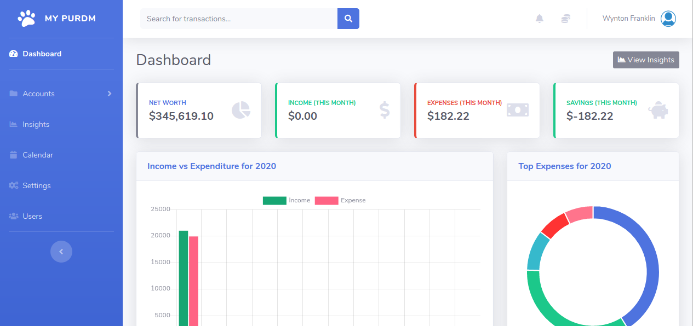

# PURDM - Your Own Expense Manager (wfexpenses)

Purrrr...diem. PURDM is a open source expense manager/host it yourself solution web application. It allows you 
to host your own expense manager that you can access via web and mobile application.
This means you have full control of your data and not some other company. You can delete your application
and all your data will be gone. Keep companies out of your business with PURDM.



## Installation

You can install PURDM on any web host that supports PHP. Head to the 
[releases](https://github.com/wyntonfranklin/wfexpenses/releases) 
section and download the latest release. Copy this file to your web server and 
get started hosting your own expense manager.

The following files must be writable by the server. Give the 
appropriate permissions
* /assets
* /protected/runtime
* /protected/update.sh

**Do the above otherwise the application would not work correctly**

### Your own PURDM Domain
If you need a PURDM domain to point to your server we can point it for you.
Use this form [here](https://forms.gle/qThfHMoKHAdgafKs8) to submit your application.
So you can have john.purdm.com or mary.purdm.com. Or any sub domain you like.

### Support for the app
If you need support or additional features added to your version of PURDM that is possible.
Use this form [here](https://forms.gle/qThfHMoKHAdgafKs8) to submit a support request or feature upgrade.

Some services offered
* Setup and installation (Digital Ocean, Linode)
* Changes and updates (Request changes to your expense manger)
* New features (Suggest and get sent you own updates)

## Server Requirements

* Linux Server
* PHP > 5.6
* PHP Curl
* MySQL
* php-dom


## Features

PURDM comes with some great features.

* Dashboard showing net worth and month income vs expenses
* Insights giving drill down of your expense. You can change the date ranges.
* Calendar so you can see went you made certain purchases
* Create as many accounts as you need
* Recurring transactions
* Insights on specific categories and expenses
* Colourful graphs and charts
* Mobile application
* Add multiple users
* Download/Upload Transactions any time you want
* Get frequent updates

## Mobile Application

Currently we have an android application for PURDM. All you need to 
do is provide the domain and your user credentials and you are good
to go. Get it [here](https://play.google.com/store/apps/details?id=com.purdm.app&hl=en)

## Development 

Download this repo or use this link [here](https://github.com/wyntonfranklin/wfexpenses.git)
You need to download Yii and add it to the repo you downloaded. You can access
a copy of the Yii version I used [here](https://wfspace.sfo2.digitaloceanspaces.com/yii.zip).

**Requirements**
* Yii 1.1
* PHP
* MySQL
* Grunt
* Node
* Npm

### Steps

* First download the repo giving the link provided.
* Insure you have in your PHP version the required server requirements listed above.
* Download the Yii version via the link provided [here](https://wfspace.sfo2.digitaloceanspaces.com/yii.zip).
Place the extracted version of yii in your base directory. The name of the folder should be yii.
* Download the extensions required to run this application from [here](https://wfspace.sfo2.digitaloceanspaces.com/extensions.zip)
These extensions you download will be required to run your application properly. Place the extensions in your protected folder under the folder name
extensions.
* In your database create a database to hold your application.
* Setup your configuration path for your server or virtual host. An example can be found below.

```html
<VirtualHost *:80>
    DocumentRoot "C:\Users\wfranklin\Documents\GitHub\wfexpenses"
    ServerName demo.wfexpenses.com
    ServerAlias demo.wfexpenses.com
    <Directory "C:\Users\wfranklin\Documents\GitHub\wfexpenses"> 
        RewriteEngine on
        RewriteRule ^index.php/ - [L,R=404]
        RewriteCond %{REQUEST_FILENAME} !-f
        RewriteCond %{REQUEST_FILENAME} !-d
        RewriteRule . index.php
        AllowOverride All
        Require all Granted        
        AllowOverride All
        Require all Granted
    </Directory>
</VirtualHost>
```
* Finally head to your base domain and run the setup.
* If you need further directions on running a `yii 1.1` version app check out this tutorial [here](https://app.wftutorials.com/tutorial/111).
You can look at the **directory structure** and **additional configurations** chapters for more insight.

## Acknowledgements

* Bootstrap theme - https://startbootstrap.com/themes/sb-admin-2/


